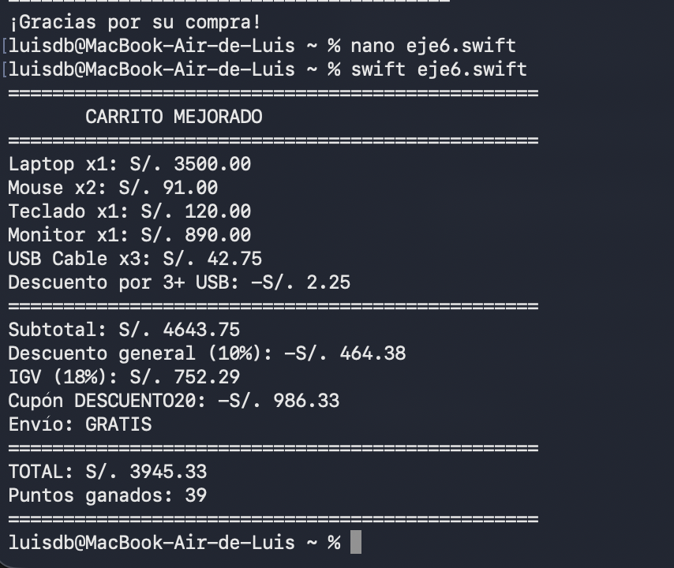

# Prompts utilizados - Laboratorio 02

## Herramienta de IA utilizada

ChatGPT

## Ejercicio 6 - Carrito mejorado

### Prompt (estructura CTRFE)

```text
CONTEXTO:
Estoy aprendiendo Swift y en esta semana estoy practicando estructuras
condicionales y bucles. Ya hice un carrito de compras básico con productos,
cantidades, precios, descuentos e IGV.

TAREA:
Ayúdame a mejorar mi carrito de compras en Swift. Necesito agregar estas
funciones:

- Si se compran 3 o más unidades del mismo producto, aplicar 5% de descuento
  adicional a ese producto.
- Si el cupón es "DESCUENTO20", aplicar 20% de descuento adicional al total.
- El envío debe ser gratis si el total supera S/. 3000; si no, debe costar S/. 25.
- Calcular 1 punto de fidelidad por cada S/. 100 de compra.
- Validar que ningún precio sea negativo y que la cantidad no sea 0.

RESTRICCIONES:
Quiero usar solamente temas básicos que he aprendido hasta ahora en Swift,
como variables, constantes, if, else, switch, for y while.
No uses arreglos porque todavía no los hemos estudiado.
Mantén el código sencillo y fácil de entender.
Usa como base la lógica de mi carrito del ejercicio anterior.

FORMATO:
Dame el código completo en Swift.
Cada línea generada debe tener un comentario específico que explique qué hace,
porque es un requisito del laboratorio.

EJEMPLO:
Si un producto tiene cantidad 3, debe recibir el 5% adicional.
Si el total supera S/. 3000, el envío debe ser gratis.
Al final quiero mostrar el total, el costo de envío y los puntos obtenidos.
```

### ¿Funcionó a la primera?

Sí. El código compiló y se verificaron el descuento por cantidad, el cupón,
el envío gratuito, los puntos de fidelidad y el total final.

### ¿La IA usó algo que no conocías?

No. La solución utiliza variables, constantes, condicionales y un bucle `for`.
No utiliza arreglos ni estructuras avanzadas.

### Evidencia de ejecución

Comando ejecutado:

```bash
swift eje6.swift
```

La ejecución confirma que las tres unidades de `USB Cable` recibieron el 5% de
descuento adicional, el cupón `DESCUENTO20` aplicó el 20%, el envío fue gratuito
y se otorgaron 39 puntos de fidelidad. El total final fue **S/. 3945.33**.


