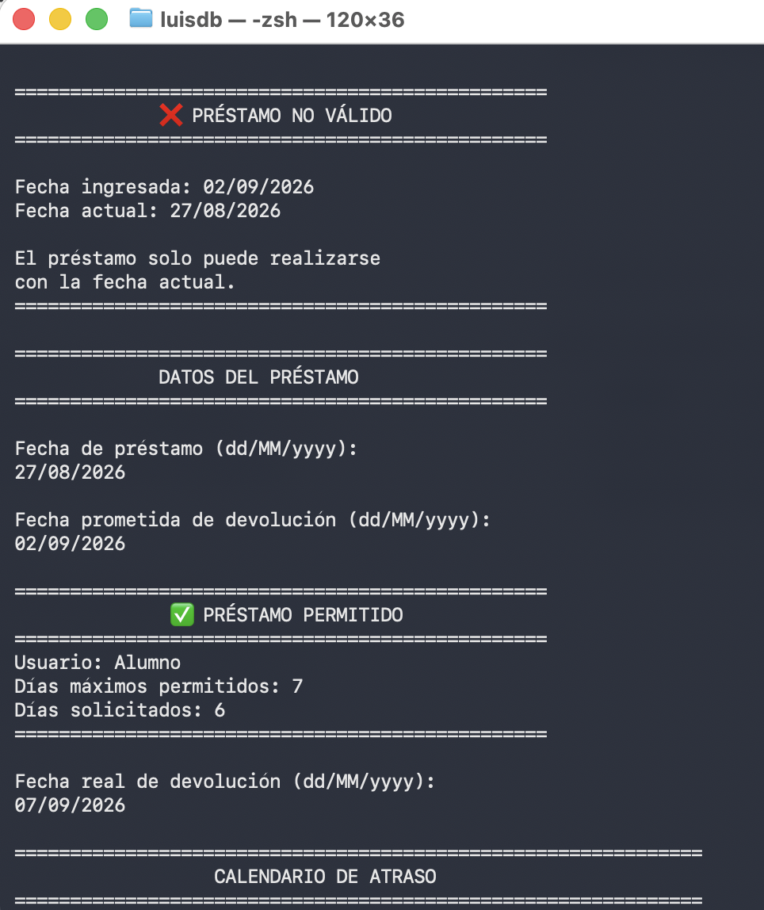
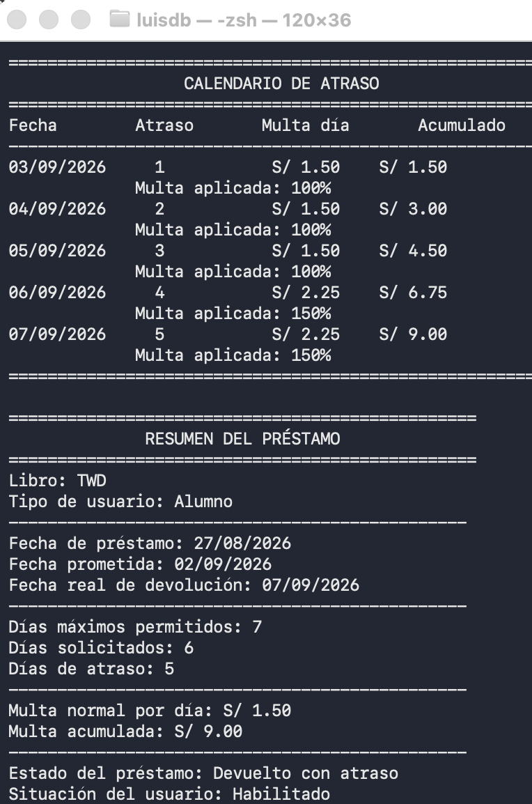
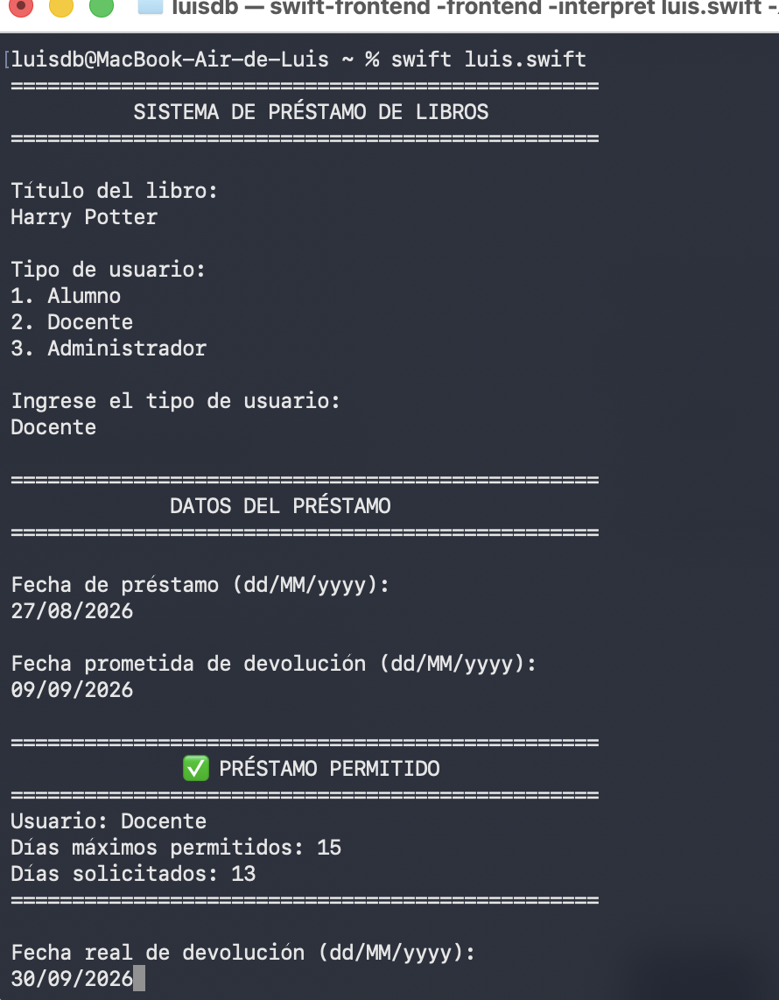
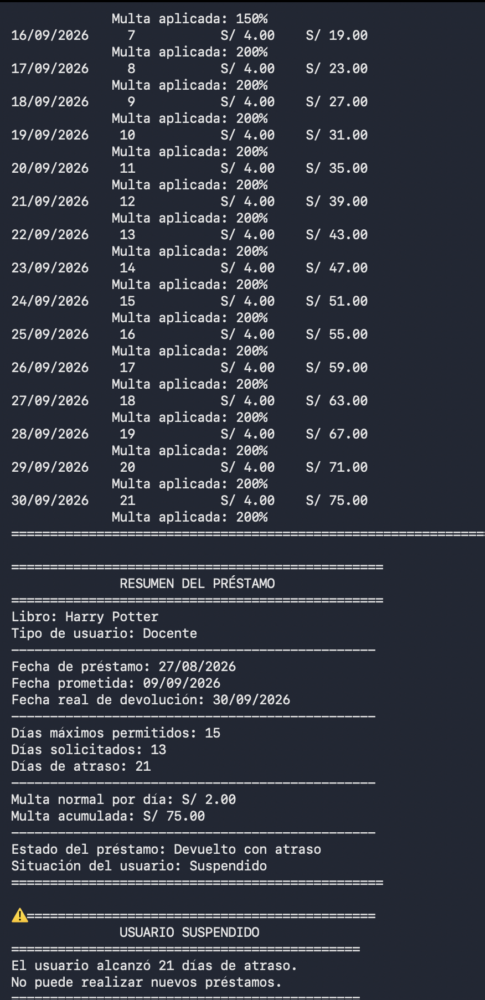
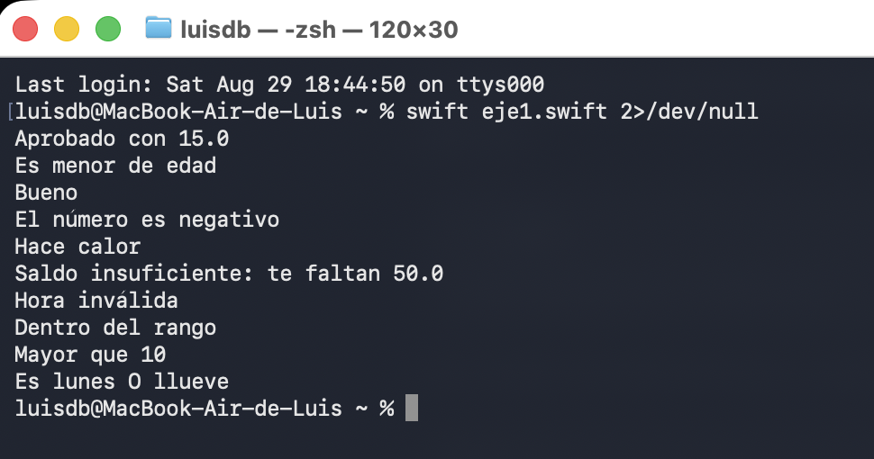
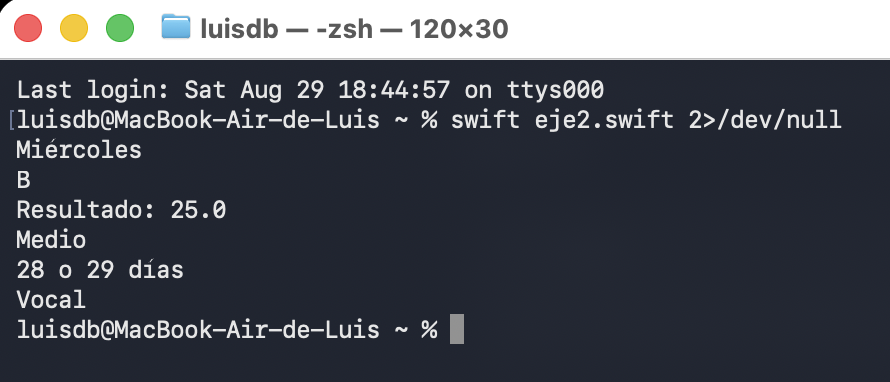

# Sistema de préstamo de libros

## Descripción

Este ejercicio implementa en Swift un sistema de préstamo de libros ejecutado desde consola. El programa solicita el título del libro, el tipo de usuario y las fechas del préstamo para validar la operación y calcular posibles multas por atraso.

Se contemplan tres tipos de usuario:

| Usuario | Días máximos | Multa base por día |
| --- | ---: | ---: |
| Alumno | 7 días | S/ 1.50 |
| Docente | 15 días | S/ 2.00 |
| Administrador | 10 días | S/ 3.00 |

## Funcionamiento

El programa realiza las siguientes operaciones:

1. Solicita el título del libro y el tipo de usuario.
2. Valida que la fecha de préstamo coincida con la fecha actual.
3. Comprueba que la fecha prometida no sea anterior al préstamo ni exceda los días permitidos para el usuario.
4. Registra la fecha real de devolución y calcula los días de atraso.
5. Aplica una multa progresiva:
   - Días 1 al 3: 100 % de la multa base.
   - Días 4 al 6: 150 % de la multa base.
   - Día 7 en adelante: 200 % de la multa base.
6. Muestra un calendario con la fecha, los días de atraso, la multa diaria y el monto acumulado.
7. Presenta un resumen final. Si el atraso alcanza 10 días o más, el usuario queda suspendido.

El código fuente se encuentra en [`EjercicioPractico.playground/Contents.swift`](EjercicioPractico.playground/Contents.swift).

## Prompt utilizado

El ejercicio se desarrolló paso a paso mediante los siguientes mensajes:

1. **Primer mensaje**

   > Quiero hacer un ejercicio en Swift sobre un sistema de préstamo de libros. Necesito que me ayudes paso a paso y que el código sea sencillo para ejecutarlo en Terminal usando `nano` y luego `swift archivo.swift`.

2. **Segundo mensaje**

   > El sistema debe pedir el título del libro y el tipo de usuario. Tendremos tres tipos: Alumno, Docente y Administrador.

3. **Tercer mensaje**

   > Cada usuario debe tener una cantidad máxima de días de préstamo: Alumno 7 días, Docente 15 días y Administrador 10 días.

4. **Cuarto mensaje**

   > También cada usuario tendrá una multa normal por día de atraso: Alumno S/ 1.50, Docente S/ 2.00 y Administrador S/ 3.00.

5. **Quinto mensaje**

   > Ahora quiero trabajar con fechas. El sistema debe pedir la fecha de préstamo y la fecha prometida de devolución usando el formato `dd/MM/yyyy`.

6. **Sexto mensaje**

   > La fecha prometida no puede ser anterior a la fecha de préstamo. Si eso ocurre, debe mostrar error y volver a pedir los datos.

7. **Séptimo mensaje**

   > También quiero que se calcule cuántos días de préstamo está solicitando el usuario. Si supera su máximo permitido, debe aparecer “Préstamo no permitido”.

8. **Octavo mensaje**

   > Por ejemplo, si es Alumno y pide más de 7 días, no debe permitir el préstamo. Si es Docente, máximo 15 días. Si es Administrador, máximo 10 días.

9. **Noveno mensaje**

   > Si el préstamo sí cumple los días permitidos, debe mostrar “Préstamo permitido” y continuar con el proceso.

10. **Décimo mensaje**

    > Después quiero ingresar la fecha real de devolución del libro. Esa fecha no puede ser anterior a la fecha de préstamo.

11. **Undécimo mensaje**

    > Quiero calcular los días de atraso comparando la fecha prometida con la fecha real de devolución. Si devuelve antes o el mismo día, los días de atraso deben ser 0.

12. **Duodécimo mensaje**

    > Ahora agreguemos una multa progresiva. Del día 1 al 3 de atraso se cobra la multa normal de cada usuario.

13. **Decimotercer mensaje**

    > Del día 4 al 6 de atraso, quiero que la multa aumente un 50% adicional por cada día.

14. **Decimocuarto mensaje**

    > Desde el día 7 de atraso en adelante, quiero que la multa tenga un 100% adicional por cada día.

15. **Decimoquinto mensaje**

    > Quiero que la multa se calcule día por día y que se vaya acumulando.

16. **Decimosexto mensaje**

    > También quiero mostrar un calendario de atraso donde aparezca: fecha, número de día de atraso, multa del día y multa acumulada.

17. **Decimoséptimo mensaje**

    > Por ejemplo, para Alumno con multa de S/ 1.50: días 1 al 3 paga S/ 1.50, días 4 al 6 paga S/ 2.25 y desde el día 7 paga S/ 3.00.

18. **Decimoctavo mensaje**

    > Quiero agregar el estado del préstamo. Si no tiene atraso, debe mostrar “Devuelto a tiempo”. Si tiene atraso, “Devuelto con atraso”.

19. **Decimonoveno mensaje**

    > Ahora agreguemos la situación del usuario. Antes de llegar a 10 días de atraso debe estar “Habilitado”.

20. **Vigésimo mensaje**

    > Si llega a 10 días de atraso o más, el usuario debe quedar “Suspendido para nuevos préstamos”.

21. **Vigésimo primer mensaje**

    > La suspensión debe aplicar a cualquier usuario: Alumno, Docente o Administrador, no solamente a uno.

22. **Vigésimo segundo mensaje**

    > Quiero que aunque tenga 7, 8 o 9 días de atraso el sistema siga calculando su multa normalmente. Recién al llegar a 10 días debe quedar suspendido.

23. **Vigésimo tercer mensaje**

    > También quiero validar la fecha actual. La fecha de préstamo debe ser obligatoriamente la fecha del día en que se ejecuta el programa.

24. **Vigésimo cuarto mensaje**

    > Si ingreso una fecha de ayer o una fecha futura como fecha de préstamo, debe mostrar “Préstamo no válido” y volver a pedir la fecha.

25. **Vigésimo quinto mensaje**

    > Usa `Date()`, `Calendar` y `DateFormatter` para comprobar automáticamente la fecha actual, sin escribir la fecha manualmente en el código.

26. **Vigésimo sexto mensaje**

    > Al final quiero un resumen del préstamo que muestre: libro, tipo de usuario, fecha de préstamo, fecha prometida, fecha real de devolución, días permitidos, días solicitados, días de atraso, multa normal, multa total, estado del préstamo y situación del usuario.

27. **Último mensaje**

    > Ahora une todo en un solo código Swift, pero mantenlo sencillo y ordenado como lo hemos venido haciendo. Usa `Foundation`, `readLine()`, `while`, `switch`, `if/else`, `Calendar`, `DateFormatter` y comentarios con `// MARK:`. No uses cosas demasiado avanzadas. Debe poder ejecutarse con `nano prestamos.swift` y luego `swift prestamos.swift`.

## Evidencias de funcionamiento

### Caso 1: Alumno

El sistema rechaza primero una fecha de préstamo distinta de la fecha actual. Después acepta el préstamo del alumno por 6 días, debido a que se encuentra dentro del máximo permitido de 7 días.



La devolución presenta 5 días de atraso. El calendario aplica S/ 1.50 durante los tres primeros días y S/ 2.25 durante los días cuarto y quinto. El resultado final es una multa acumulada de **S/ 9.00** y el usuario permanece habilitado.



### Caso 2: Docente

El docente solicita el libro *Harry Potter* desde el 27/08/2026 hasta el 09/09/2026. Los 13 días solicitados se encuentran dentro del máximo permitido de 15 días.



La devolución se realiza el 30/09/2026 y genera 21 días de atraso. El sistema aplica las tres etapas de la multa progresiva y obtiene un total de **S/ 75.00**. Como el atraso supera los 10 días, el docente queda suspendido para nuevos préstamos.



## Resultado

Las pruebas demuestran que el programa valida correctamente los límites de préstamo, calcula las multas progresivas, acumula los importes por fecha y determina el estado final del usuario.

---

# Laboratorio 02 - Rama manual

## Evidencias de los ejercicios 1 y 2

Los ejercicios se probaron desde Terminal con el intérprete de Swift. Como los
valores usados en el laboratorio son fijos, Swift muestra advertencias indicando
que algunas alternativas de los condicionales o de `switch` nunca se ejecutarán
durante esa prueba. Estas advertencias no son errores y el programa se ejecuta
correctamente.

Se agregó `2>/dev/null` al comando para ocultar esas advertencias. El número `2`
representa la salida de errores y advertencias (`stderr`), mientras que la salida
normal del programa (`stdout`) continúa apareciendo en la Terminal.

### Ejercicio 1: Condicionales `if / else / else if`

Comando ejecutado:

```bash
swift eje1.swift 2>/dev/null
```

El programa evaluó la nota, la edad, la clasificación de una nota, el signo de
un número, la temperatura, el saldo disponible, la hora y las tres predicciones
solicitadas. La salida confirma, entre otros resultados, que la edad `17` se
clasifica como menor de edad, la nota `16` como `Bueno` y el número `-5` como
negativo.



El código del playground está en
[`Ejercicio_1_Condicionales.playground/Contents.swift`](Ejercicio_1_Condicionales.playground/Contents.swift).

### Ejercicio 2: Sentencia `switch`

Comando ejecutado:

```bash
swift eje2.swift 2>/dev/null
```

El programa identificó el día de la semana, convirtió una nota numérica en
letra, ejecutó la operación seleccionada en la calculadora, clasificó el precio
del producto y comprobó las dos predicciones. Para los valores dados imprimió
`Miércoles`, `B`, `Resultado: 25.0`, `Medio`, `28 o 29 días` y `Vocal`.



El código del playground está en
[`Ejercicio_2_Switch.playground/Contents.swift`](Ejercicio_2_Switch.playground/Contents.swift).
