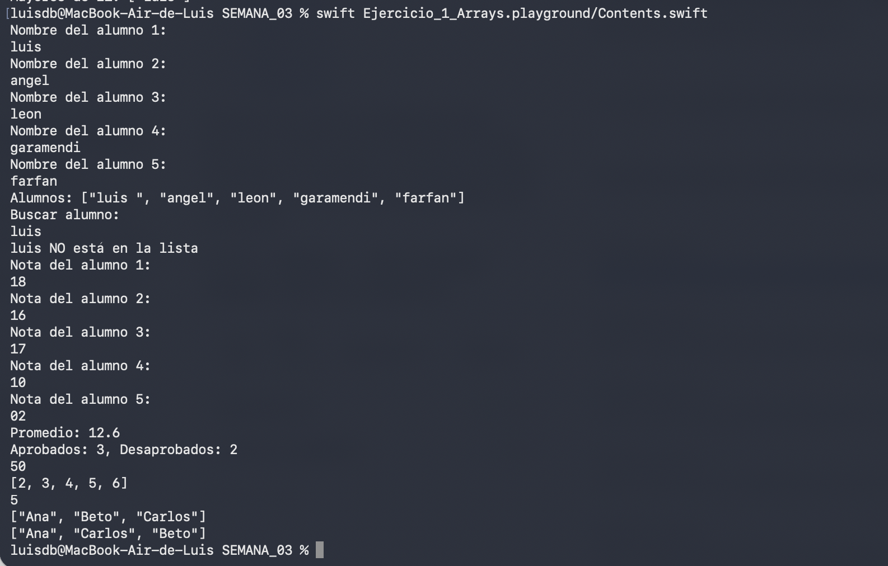
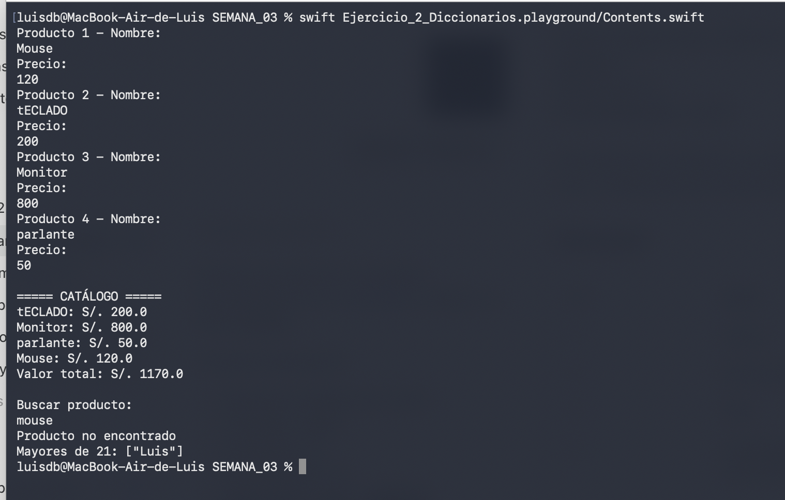
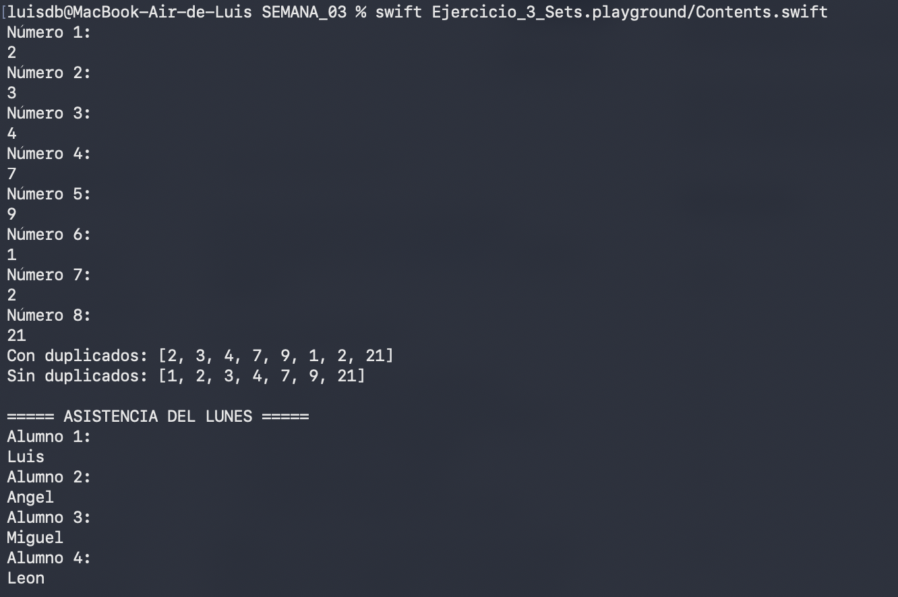
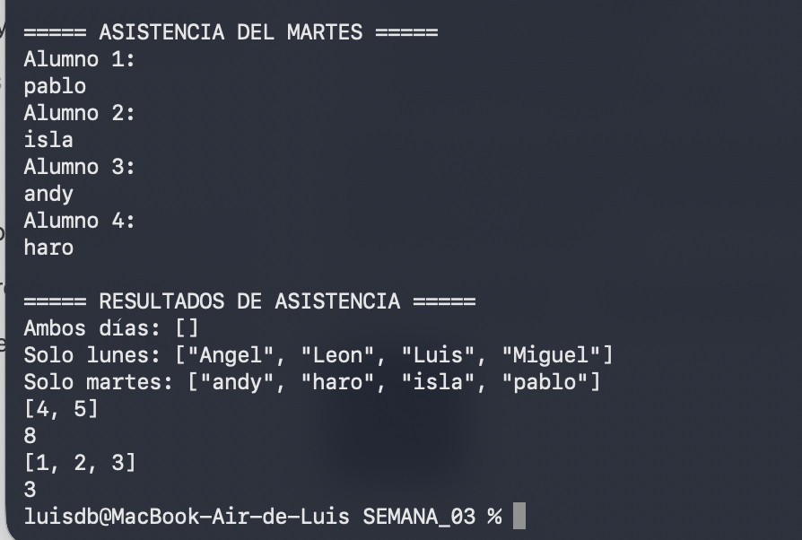
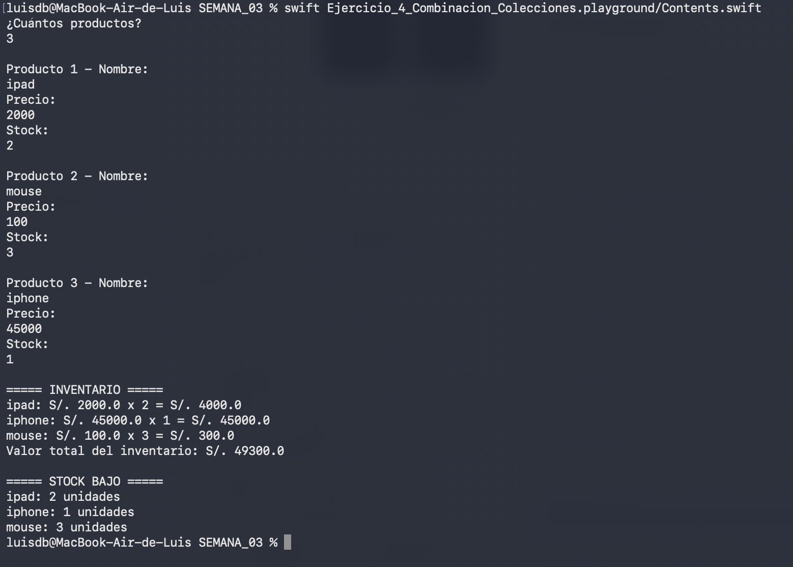

# Laboratorio 03 - Colecciones en Swift

**Curso:** Programación en Móviles Avanzado  
**Semana:** 3  
**Rama:** `manual`  
**Desarrollado por:** LuisDB

Este laboratorio contiene cinco ejercicios interactivos sobre arrays, diccionarios,
sets y combinación de colecciones. Todos reciben datos mediante `readLine()`.

## Ejercicios

| N.º | Tema | Playground | Código fuente |
| --- | --- | --- | --- |
| 1 | Arrays | [Abrir ejercicio 1](./Ejercicio_1_Arrays.playground) | [Contents.swift](./Ejercicio_1_Arrays.playground/Contents.swift) |
| 2 | Diccionarios | [Abrir ejercicio 2](./Ejercicio_2_Diccionarios.playground) | [Contents.swift](./Ejercicio_2_Diccionarios.playground/Contents.swift) |
| 3 | Sets | [Abrir ejercicio 3](./Ejercicio_3_Sets.playground) | [Contents.swift](./Ejercicio_3_Sets.playground/Contents.swift) |
| 4 | Combinación de colecciones | [Abrir ejercicio 4](./Ejercicio_4_Combinacion_Colecciones.playground) | [Contents.swift](./Ejercicio_4_Combinacion_Colecciones.playground/Contents.swift) |
| 5 | Carrito de compras 2.0 | [Abrir ejercicio 5](./Ejercicio_5_Carrito_2_0.playground) | [Contents.swift](./Ejercicio_5_Carrito_2_0.playground/Contents.swift) |

## Cómo ejecutar

La forma recomendada para probar `readLine()` es desde Terminal. Primero hay que
entrar en la carpeta de la semana 3:

```bash
cd /Users/luisdb/Documents/MOVILES_AVANZADOS_DIONICIO/SEMANA_03
```

Después se ejecuta el ejercicio deseado:

```bash
# Ejercicio 1
swift Ejercicio_1_Arrays.playground/Contents.swift

# Ejercicio 2
swift Ejercicio_2_Diccionarios.playground/Contents.swift

# Ejercicio 3
swift Ejercicio_3_Sets.playground/Contents.swift

# Ejercicio 4
swift Ejercicio_4_Combinacion_Colecciones.playground/Contents.swift

# Ejercicio 5
swift Ejercicio_5_Carrito_2_0.playground/Contents.swift
```

También se puede abrir cualquier archivo `.playground` en Xcode. Si se ejecuta
desde Xcode, la consola se muestra u oculta con `Shift + Command + Y`.

## Datos para las pruebas

### Ejercicio 1 - Arrays

Ingresar cinco alumnos, buscar a `Carla` y registrar cinco notas:

```text
Ana, Beto, Carla, Diego, Elena
Carla
15, 12, 18, 13, 10
```

Resultado principal esperado:

```text
Carla está en la lista
Promedio: 13.6
Aprobados: 3, Desaprobados: 2
```

### Ejercicio 2 - Diccionarios

Ingresar los siguientes productos y buscar `Mouse`:

```text
Laptop: 3500
Mouse: 45.5
Teclado: 120
Monitor: 800
```

Resultado principal esperado:

```text
Valor total: S/. 4465.5
Mouse cuesta S/. 45.5
Mayores de 21: ["Luis"]
```

El orden del catálogo puede variar porque un diccionario no garantiza un orden.

### Ejercicio 3 - Sets

Usar los números `1, 2, 2, 3, 4, 4, 5, 1`. Para asistencia, ingresar:

```text
Lunes: Ana, Beto, Carla, Diego
Martes: Carla, Diego, Elena, Fabio
```

Resultado principal esperado:

```text
Sin duplicados: [1, 2, 3, 4, 5]
Ambos días: ["Carla", "Diego"]
Solo lunes: ["Ana", "Beto"]
Solo martes: ["Elena", "Fabio"]
```

### Ejercicio 4 - Combinación de colecciones

Ingresar tres productos:

```text
Laptop: precio 3500, stock 2
Mouse: precio 45.5, stock 4
Teclado: precio 120, stock 10
```

Resultado principal esperado:

```text
Valor total del inventario: S/. 8382.0
Laptop: 2 unidades
Mouse: 4 unidades
```

### Ejercicio 5 - Carrito de compras 2.0

Ingresar dos productos y el nombre de la clienta:

```text
Laptop: precio 3500, cantidad 1
Mouse: precio 45.5, cantidad 2
María García
```

Resultado principal esperado:

```text
Cliente: María García (VIP)
Subtotal: S/. 3591.00
Descuento (10.0%): -S/. 359.10
IGV (18%): S/. 581.74
TOTAL: S/. 3813.64
```

## Evidencias de ejecución

Las capturas deben mostrar el comando ejecutado, los datos ingresados, el resultado
principal y el retorno normal al prompt de Terminal, sin errores.

Guardar las imágenes en `SEMANA_03/evidencias/` con estos nombres:

- `ejercicio-1-arrays-terminal.png`
- `ejercicio-2-diccionarios-terminal.png`
- `ejercicio-3-sets-terminal-1.png`
- `ejercicio-3-sets-terminal-2.png`
- `ejercicio-4-combinacion-terminal.png`
- `ejercicio-5-carrito-terminal.png`

Estado de las evidencias:

- [x] Ejercicio 1 - ejecución completada sin errores
- [x] Ejercicio 2 - ejecución completada sin errores
- [x] Ejercicio 3 - ejecución completada sin errores
- [x] Ejercicio 4 - ejecución completada sin errores
- [ ] Ejercicio 5 - captura pendiente

### Evidencia 1 - Arrays

La ejecución registró cinco alumnos y cinco notas. Obtuvo un promedio de `12.6`,
con tres aprobados y dos desaprobados, y terminó sin errores. La búsqueda mostró
el caso "no encontrado" porque el nombre registrado contenía un espacio final y
la comparación de `String` requiere una coincidencia exacta.



### Evidencia 2 - Diccionarios

La ejecución registró cuatro productos, mostró el catálogo, calculó un valor total
de `S/. 1170.0` y terminó sin errores. La búsqueda mostró el caso "no encontrado"
porque el producto fue registrado como `Mouse` y se buscó como `mouse`; las claves
de tipo `String` distinguen entre mayúsculas y minúsculas.



### Evidencia 3 - Sets

La ejecución recibió ocho números y eliminó correctamente el valor duplicado `2`.
También comparó la asistencia de lunes y martes. Como se ingresaron nombres
distintos en cada día, la intersección quedó vacía y todos los nombres aparecieron
en su conjunto exclusivo. Finalmente, las cuatro predicciones produjeron los
resultados esperados y el programa terminó sin errores.





### Evidencia 4 - Combinación de colecciones

La ejecución combinó los diccionarios de precios y stocks para tres productos.
Calculó correctamente un valor total de inventario de `S/. 49300.0` y mostró
`ipad`, `iphone` y `mouse` como stock bajo porque todos tienen menos de cinco
unidades. El programa terminó sin errores.



Las evidencias restantes se insertarán aquí cuando estén disponibles.
