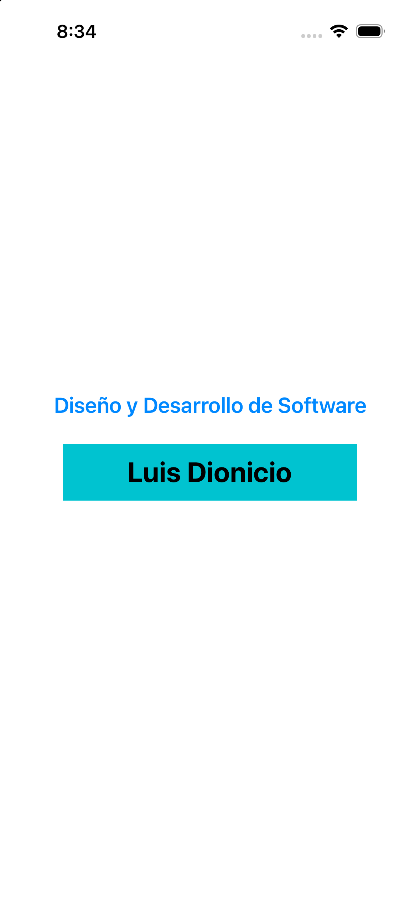

# Laboratorio 05 - UIKit y Storyboard (rama manual)

Este proyecto reproduce el ejemplo inicial de la guía usando UIKit, Interface Builder y Storyboard.

## Contenido

- Un `UILabel` centrado con el texto **Diseño y Desarrollo de Software**.
- Un segundo `UILabel` con el nombre **Luis Dionicio**, fondo de color y fuente de mayor tamaño.
- Restricciones de Auto Layout para conservar la posición al cambiar la orientación.
- Ejecución verificada en **iPhone 16 con iOS 26.5**.

## Ejecución

1. Abre `LAB_05/LAB_05.xcodeproj` en Xcode.
2. Selecciona el esquema `LAB_05`.
3. Selecciona `iPhone 16` como destino.
4. Ejecuta con `Cmd + R`.

## Evidencia

