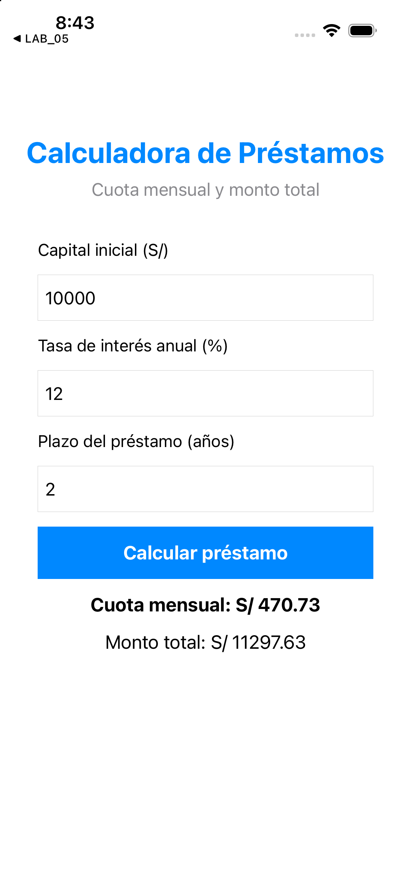

# Laboratorio 05 - Ejercicios finales (rama Ejercicio)

Aplicaciones UIKit desarrolladas con Storyboard para resolver los ejercicios solicitados en la guía. Los dos proyectos funcionan de manera independiente y están preparados para ejecutarse en iPhone 16.

## 1. Calculadora de IMC

### Funcionamiento

La aplicación recibe el peso en kilogramos y la altura en metros. Aplica la fórmula:

```text
IMC = peso / (altura × altura)
```

Después muestra el resultado con dos decimales y su clasificación: bajo peso, peso normal, sobrepeso u obesidad. También valida campos vacíos, valores no numéricos y valores menores o iguales a cero.

### Prueba solicitada

- Peso: `72 kg`
- Altura: `1.73 m`
- Resultado: `IMC: 24.06 - Peso normal`

### Ejecución

1. Abre `LAB_05/LAB_05.xcodeproj` en Xcode.
2. Selecciona el esquema `LAB_05`.
3. Selecciona `iPhone 16` como destino.
4. Ejecuta con `Cmd + R`.

### Evidencia


## 2. Calculadora de préstamos

### Funcionamiento

La aplicación recibe el capital inicial, la tasa de interés anual y el plazo en años. Convierte la tasa a interés mensual y el plazo a número de cuotas para aplicar la fórmula de amortización indicada en la guía:

```text
r = tasa anual / 100 / 12
n = años × 12
cuota = capital × [r(1 + r)^n] / [(1 + r)^n - 1]
total = cuota × n
```

También acepta préstamos sin interés y valida campos vacíos, valores no numéricos y valores fuera de rango.

### Prueba realizada

- Capital inicial: `S/ 10000`
- Tasa anual: `12 %`
- Plazo: `2 años`
- Cuota mensual: `S/ 470.73`
- Monto total: `S/ 11297.63`

### Ejecución

1. Abre `LAB_05_Prestamos/LAB_05_Prestamos.xcodeproj` en Xcode.
2. Selecciona el esquema `LAB_05`.
3. Selecciona `iPhone 16` como destino.
4. Ejecuta con `Cmd + R`.

### Evidencia


