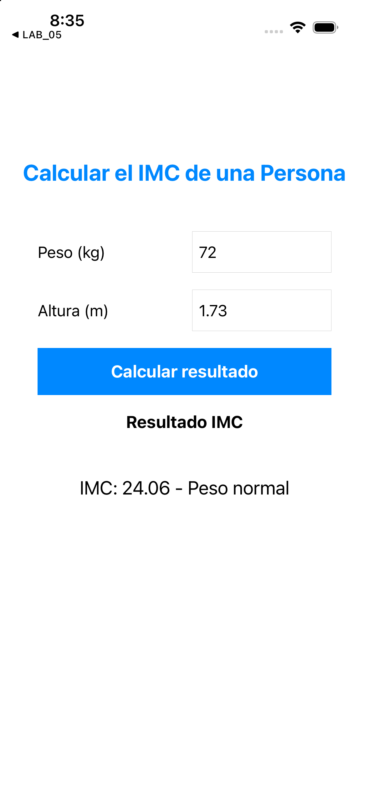

# Laboratorio 05 - Calculadora de IMC (rama Ejercicio)

Aplicación UIKit desarrollada con Storyboard para calcular el índice de masa corporal solicitado en la guía.

## Funcionamiento

La aplicación recibe el peso en kilogramos y la altura en metros. Aplica la fórmula:

```text
IMC = peso / (altura × altura)
```

Después muestra el resultado con dos decimales y su clasificación: bajo peso, peso normal, sobrepeso u obesidad. También valida campos vacíos, valores no numéricos y valores menores o iguales a cero.

## Prueba solicitada

- Peso: `72 kg`
- Altura: `1.73 m`
- Resultado: `IMC: 24.06 - Peso normal`

## Ejecución

1. Abre `LAB_05/LAB_05.xcodeproj` en Xcode.
2. Selecciona el esquema `LAB_05`.
3. Selecciona `iPhone 16` como destino.
4. Ejecuta con `Cmd + R`.

## Evidencia


